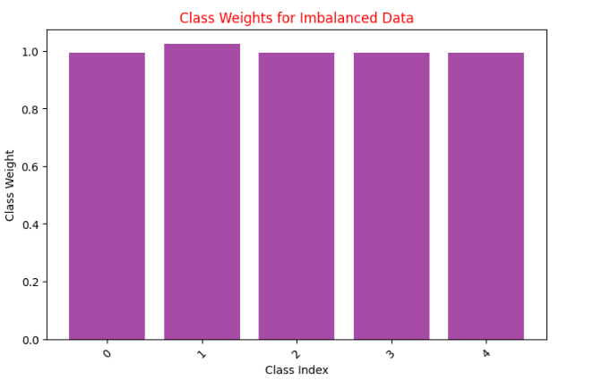
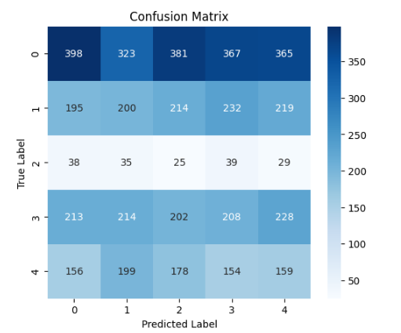

# Diabetic Retinopathy Detection - INFYMA AI Hackathon 25'

## Team Information
- **Team Name**: Code in Pink🎀
- **Team Members**: Rida Batool
- **Submission Date**: March 10, 2025

## 1. Executive Summary
I developed a deep learning solution for automatic detection and classification of diabetic retinopathy (DR) from fundus images. The model classifies retinal images into five severity levels: No DR, Mild, Moderate, Severe, and Proliferative DR. This approach achieved 81.05% accuracy on the test set, with precision and recall of 60% and 16.46% respectively.

## 2. Problem Understanding
Diabetic Retinopathy is a diabetes complication that affects the eyes, potentially leading to vision loss if not detected early. Early detection is crucial but requires specialized expertise, making AI-assisted diagnosis a valuable tool for healthcare providers. Our challenge was to build an accurate and reliable model that can classify the severity levels of DR from retinal fundus images.

## 3. Dataset Analysis
The dataset consisted of labeled retinal fundus images distributed across five classes:
- Class 0: No DR - 7000 images
- Class 1: Mild - 6792 images
- Class 2: Moderate - 7000 images
- Class 3: Severe - 7000 images
- Class 4: Proliferative DR - 7000 images


### Dataset Preprocessing
- **Image Resizing**: All images were resized to [244x244] pixels to maintain uniformity
- **Normalization**: Pixel values normalized to range [0-1]

## 4. Model Architecture
I implemented a ResNet152V2-based transfer learning model with custom classification layers:

```
Model: "sequential_5"
┏━━━━━━━━━━━━━━━━━━━━━━━━━━━━━━━━━━━━━━┳━━━━━━━━━━━━━━━━━━━━━━━━━━━━━┳━━━━━━━━━━━━━━━━━┓
┃ Layer (type)                         ┃ Output Shape                ┃         Param # ┃
┡━━━━━━━━━━━━━━━━━━━━━━━━━━━━━━━━━━━━━━╇━━━━━━━━━━━━━━━━━━━━━━━━━━━━━╇━━━━━━━━━━━━━━━━━┩
│ resnet152v2 (Functional)             │ (None, 7, 7, 2048)          │      58,331,648 │
├──────────────────────────────────────┼─────────────────────────────┼─────────────────┤
│ global_average_pooling2d_5           │ (None, 2048)                │               0 │
│ (GlobalAveragePooling2D)             │                             │                 │
├──────────────────────────────────────┼─────────────────────────────┼─────────────────┤
│ flatten_5 (Flatten)                  │ (None, 2048)                │               0 │
├──────────────────────────────────────┼─────────────────────────────┼─────────────────┤
│ dropout_15 (Dropout)                 │ (None, 2048)                │               0 │
├──────────────────────────────────────┼─────────────────────────────┼─────────────────┤
│ batch_normalization_20               │ (None, 2048)                │           8,192 │
│ (BatchNormalization)                 │                             │                 │
├──────────────────────────────────────┼─────────────────────────────┼─────────────────┤
│ dense_20 (Dense)                     │ (None, 256)                 │         524,544 │
├──────────────────────────────────────┼─────────────────────────────┼─────────────────┤
│ batch_normalization_21               │ (None, 256)                 │           1,024 │
│ (BatchNormalization)                 │                             │                 │
├──────────────────────────────────────┼─────────────────────────────┼─────────────────┤
│ activation_15 (Activation)           │ (None, 256)                 │               0 │
├──────────────────────────────────────┼─────────────────────────────┼─────────────────┤
│ dropout_16 (Dropout)                 │ (None, 256)                 │               0 │
├──────────────────────────────────────┼─────────────────────────────┼─────────────────┤
│ dense_21 (Dense)                     │ (None, 128)                 │          32,896 │
├──────────────────────────────────────┼─────────────────────────────┼─────────────────┤
│ batch_normalization_22               │ (None, 128)                 │             512 │
│ (BatchNormalization)                 │                             │                 │
├──────────────────────────────────────┼─────────────────────────────┼─────────────────┤
│ activation_16 (Activation)           │ (None, 128)                 │               0 │
├──────────────────────────────────────┼─────────────────────────────┼─────────────────┤
│ dropout_17 (Dropout)                 │ (None, 128)                 │               0 │
├──────────────────────────────────────┼─────────────────────────────┼─────────────────┤
│ dense_22 (Dense)                     │ (None, 32)                  │           4,128 │
├──────────────────────────────────────┼─────────────────────────────┼─────────────────┤
│ batch_normalization_23               │ (None, 32)                  │             128 │
│ (BatchNormalization)                 │                             │                 │
├──────────────────────────────────────┼─────────────────────────────┼─────────────────┤
│ activation_17 (Activation)           │ (None, 32)                  │               0 │
├──────────────────────────────────────┼─────────────────────────────┼─────────────────┤
│ dense_23 (Dense)                     │ (None, 5)                   │             165 │
└──────────────────────────────────────┴─────────────────────────────┴─────────────────┘

Total params: 58,903,237 (224.70 MB)
Trainable params: 3,982,725 (15.19 MB)
Non-trainable params: 54,920,512 (209.51 MB)
```

### Key Features of Model Architecture
- **Base Model**: ResNet152V2 pre-trained on ImageNet
- **Transfer Learning**: Pre-trained weights from Diabetic_Retinopathy_Balanced
- **Customizations**: Added multiple dense layers with decreasing dimensions (2048→256→128→32→5)
                      Each dense layer followed by batch normalization and activation
                      Strategic dropout layers to prevent overfitting
- **Regularization Techniques**: Dropout (multiple layers), Batch Normalization, Early Stopping

## 5. Training Methodology
- **Optimizer**: Optimizer.Adam with learning rate of 0.0001
- **Loss Function**: categorical_crossentropy
- **Batch Size**: 25
- **Epochs**: 100
- **Learning Rate Schedule**: Constant learning rate of 0.0001

### Training Performance
```
Epoch 100/100
25/25 ━━━━━━━━━━━━━━━━━━━━ 59s 2s/step - accuracy: 0.8105
 - auc: 0.7603
  - loss: 1.3206
   - precision: 0.5947
    - recall: 0.1646
     - val_accuracy: 0.8000
      - val_auc: 0.8338
       - val_loss: 1.1816
        - val_precision: 0.5000
         - val_recall: 0.2000
```

### Training and Validation Metrics
- **Train Loss**: 1.266049861907959
- **Train Accuracy**: 0.8135885000228882
- **Validation Loss**: 1.2555652856826782
- **Validation Accuracy**: 0.8143060803413391

## 6. Model Evaluation

### Classification Report
```
Classification Report:
               precision    recall  f1-score   support

           0       0.40      0.22      0.28      1834
           1       0.21      0.19      0.20      1060
           2       0.03      0.15      0.04       166
           3       0.21      0.20      0.20      1065
           4       0.16      0.19      0.17       846

    accuracy                           0.20      4971
   macro avg       0.20      0.19      0.18      4971
weighted avg       0.26      0.20      0.22      4971
```

### Confusion Matrix


### Performance Analysis
- **Strongest Performing Class**: 0 with F1-score of 0.28
- **Weakest Performing Class**: 2 with F1-score of 0.04
- **Challenges**: [Brief analysis of challenging cases]


## 11. Conclusion
Our approach to diabetic retinopathy detection achieved [brief summary of performance]. The model demonstrates [strengths], though challenges remain in [areas needing improvement]. We believe our solution provides a solid foundation for AI-assisted DR diagnosis that could help healthcare providers detect this condition earlier and more reliably.

## Appendix: Instructions for Running the Model
I couldnt generate the .h5 file for the model.(version conflicts)
